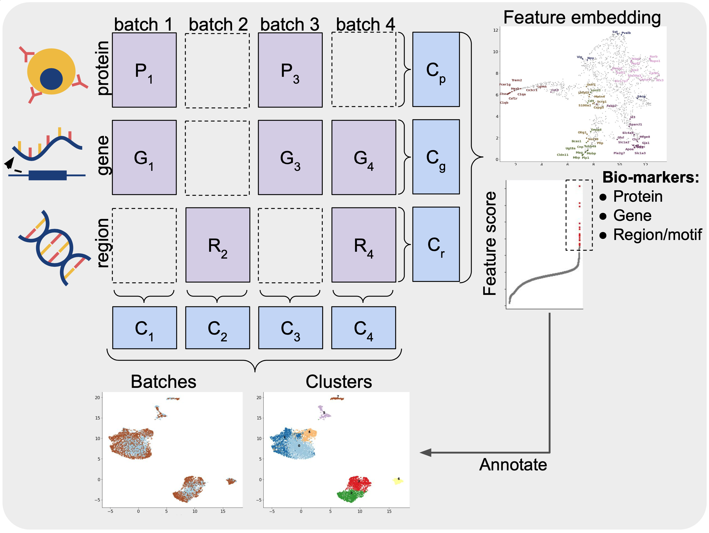

## scMoMaT: a unified framework for single cell mosaic integration and multi-modal bio-marker detection
scMoMaT v0.2.2 **Updated the post-processing step to solve the memory overflow issue**


#### Description
scMoMaT is a single-cell data integration method that is able to:
* integrate single cell multi-omics data under the mosaic scenario using matrix tri-factorization
* uncover the cell type specific bio-markers at the same time when learning a unified cell representation
* integrate cell batches with unequal cell type composition



#### Dependency
```
Python >= 3.8.10
numpy >= 1.19.5
torch >= 1.11.0
scipy >= 1.7.3
sklearn >= 0.22.1
matplotlib >= 3.5.2
umap >= 0.5.2
leidenalg >= 0.9.1
pandas >= 1.4.0
adjustText >= 0.7.3 (optional)
```


#### Directory
* `src` contains the main script of scMoMaT
* `test` contains the testing script of scMoMaT on the datasets in the manuscript and running script of baseline methods. Please refer to this folder for the reproduction of test results. The testing dataset is available upon request.
* `data` stores the datasets

#### Data
Necessary data for PBMC (the first real dataset in the manuscript, `ASAP-PBMC`) and MOp (the second real dataset in the manuscript, `MOp_5batches`) are provided, which should be suffice for the running of scMoMaT in `demo_pbmc.py` and `demo_mop_5batches.py` as examples. The dataset for the other demo scrips are available upon requests. 

#### Installation 
Install the package with 
```
pip install scmomat
```

Or install the latest version by cloning the repository with

```
git clone https://github.com/PeterZZQ/scMoMaT.git
```
Enter the root directory of the package
```
cd scMoMaT
```
And run
```
pip install .
```

Uninstall using
```
pip uninstall scmomat
```

#### Usage 
Training pipeline of scMoMaT
##### Data object `count`
  Make sure that the dataset get stored in the dictionary, and save the value to each key:
    * `nbatches`: total number of batches
    * `feats_name`: a dictionary storing the feature names for different modalities, e.g. `{"rna": np.array([aaaa, bbbb,...]), "atac": np.array([ccc, ddd, ...]), "protein": np.array([eee, fff, ...])}`
    * `modality 1` (e.g. `rna` in the example below): a `list` store all data matrices correspond to modality 1, a element correspond to one batch, elements are ordered in the list following the ordering of batches. **The batches that does not have count matrix in corresponding modality is inserted `None` as placeholder**
    * `modality 2` (e.g. `atac` in the example below): requirement the same as above.
    * `modality 3` (e.g. `protein`): requirement the same as above.
    * ...
  
  Check `demo_scmomat.ipynb` for an example. Note:
    * The number of item in the `feats_name` should match the number of modalities in `counts`. 
    * The length of lists in `modality 1`, `modality 2`, `modality 3`, etc should have the same length, which is equal to `nbatches`. (missing matrices are denoted as `None` as explained above). **The matrices must be ordered according to the batch ID in each list,** so that scMoMaT can detact parallel sequenced batches.
    * The data matrix in each modality (each list) should have the same set of features. You can do thie by 1. using the intersection of all genes/proteins in different batches; 2. Remap the chromatin regions according to the peaks of one batch. 
    * The data matrix is of the shape `(ncells, nfeatures)`, and preprocessed with `utils.preprocess()` function.

One example template is shown as below, note that the features of data matrices are matched in advance. The connection matrix (`GxR.npz`) that is used to generate pseudo-count is also provided in advance (used the code in folder `calc_pseudo_count/calc_pseudo_count.R`). Feel free to modify on the template to use your dataset.


##### First training stage
```python
import scmomat
# training device: CPU or GPU
device = torch.device("cuda:1" if torch.cuda.is_available() else "cpu")

# number of latent dimensions (20~30)
K = 30
# number of iterations
T = 4000
# [Optional] parameter lambda is set to be the default value 0.001

# 1st stage training, learning cell factors
model = scmomat.scmomat_model(counts = counts, K = K, device = device)
losses = model.train_func(T = T)

# extract cell factors
zs = model.extract_cell_factors()
```

##### Cell factor post-processing
```python
# post-processing
# neighborhood size (30~50)
n_neighbors = 30
# [Optional] neighborhood radius (between 0 and 1)
r = None
# number of parallel CPU for calculation, default 1
njobs = 8
# obtain post-processed graph
s_pair_dist, knn_indices, knn_dists = scmomat.post_process(zs, n_neighbors, njobs = 8, r = r)
```

##### Cluster and retraining
```python
# cluster with post-processed graph
# cluster resolution
resolution = 0.9
labels_leiden = scmomat.leiden_cluster(X = None, knn_indices = knn_indices, knn_dists = knn_dists, resolution = resolution)
# visualize graph with umap
umap_op = scmomat.UMAP(n_components = 2, n_neighbors = n_neighbors, min_dist = 0.20, random_state = 0, metric='precomputed', knn_dists=knn_dists, knn_indices=knn_indices)
x_umap = umap_op.fit_transform(s_pair_dist)
scmomat.plot_latent(x_umap, annos = labels_leiden, mode = "joint", save = None, figsize = (10,7), axis_label = "UMAP", markerscale = 6, s = 5, label_inplace = True, alpha = 0.7)

# 2nd stage training with cluster result, obtained feature factors
# [Optional] parameter lambda is set to be the default value 0.001
# [Optional] Update counts to include more training modalities (motif)
model2 = scmomat.scmomat_retrain(model = model, counts =  counts, labels = labels_leiden, device = device)
# number of iteractions is 2000
losses = model2.train(T = 2000)

# extract marker scores
score_feats = model2.extract_feature_factors()
```

##### Examples
The above example shows the key steps in scmomat, which does not include the ploting function. `demo_scmomat.ipynb` provides a detailed example run on `MOp_5batches` dataset (running time: training procedure takes ~5mins on NVIDIA A40 GPU, total file takes ~30mins). 

For more example, please see the test scripts in `test` folder, necessary comments are included:
* `test_pbmc.py`: The first real dataset in the manuscript (**data provided**).
* `test_bmmc_healthy.py`: The third real dataset in the maunscript.
* `test_spleen.py`: The fourth real dataset in the manuscript.
* `test_spleen_subsample.py`: The fourth real dataset in the manuscript.
* `test_mop_5batches.py`: The second real dataset in the manuscript.


#### Contact
* Ziqi Zhang: ziqi.zhang@gatech.edu
* Xiuwei Zhang: xiuwei.zhang@gatech.edu 


#### Cite
```
@article{zhang2022scmomat,
  title={scMoMaT: Mosaic integration of single cell multi-omics matrices using matrix trifactorization},
  author={Zhang, Ziqi and Sun, Haoran and Chen, Xinyu and Mariappan, Ragunathan and Chen, Xi and Jain, Mika and Efremova, Mirjana and Rajan, Vaibhav and Teichmann, Sarah and Zhang, Xiuwei},
  journal={bioRxiv},
  year={2022},
  publisher={Cold Spring Harbor Laboratory},
}
```